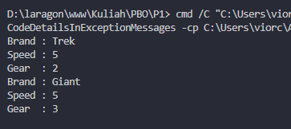
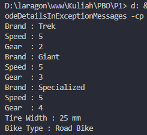

|            | Pemrograman Berbasis Object                                             |
| ---------- | ----------------------------------------------------------------------- |
| NIM        | 254107020055                                                            |
| Nama       | Caesar Vior Byrnanda                                                    |
| Kelas      | TI - 2A                                                                 |
| Repository | https://github.com/CaesarVior/PrakASD_1F_06/blob/main/src/P15/REPORT.md |

# JOBSHEET I Pengantar Konsep Pemrograman Berorientasi Objek

# Percobaan 1

# Hasil Running

# Percobaan 2

# Hasil Running

# Pertanyaan

1. Jelaskan perbedaan antara object dengan class!

   Jawaban: Object memiliki state dan behaviour atau memiliki ciri ciri atau atribut dan memiliki perilaku yang dapat dilakukan object tersebut

2. Jelaskan alasan gear dan brand dapat menjadi atribut dari object Bike!

   Jawaban: Karena gear dan brand merupakan state dari object yang memiliki ciri ciri dari atribut dari object tersebut.

3. Sebutkan salah satu kelebihan utama dari pemrograman berorientasi objek dibandingkan
   dengan pemrograman prosedural!

   Jawaban: Pemrograman yang berorientasi objek dapat lebih fleksibel dan modular. Sehingga, jika terjadi perubahan fitur maka dapat dipastikan keseluruhan program tidak akan terganggu. Jika menggunakan Pemrograman berbasis prosedural, perubahan fitur sedikit saja akan dapat mengganggu keseluruhan program

4. Apakah diperbolehkan melakukan pendefinisian dua buah atribut dalam satu baris kode seperti
   “public String nama, alamat;”?

   Jawaban: Boleh, dengan catatan tipe datanya sama. Kalau tipe datanya berbeda, maka harus didefinisikan lagi

5. Pada class RoadBike, jelaskan alasan atribut brand, speed, dan gear tidak lagi ditulis di dalam
   class tersebut!

   Jawbaan: Karena class RoadBike sudah mewarisi sifat dari Bike atau RoadBike sudah inheritance dari Bike.
